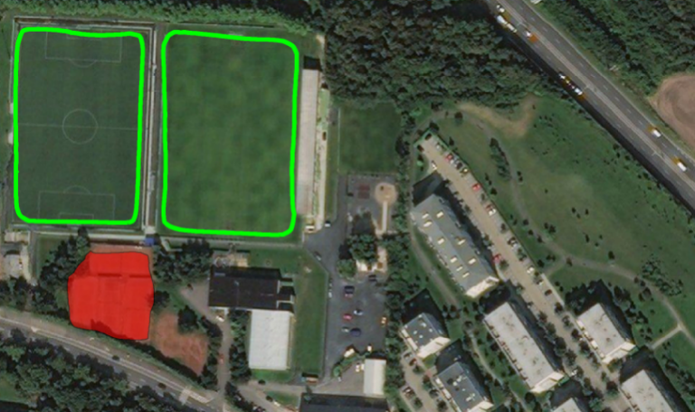

# Mask R-CNN for Object Detection and Segmentation

This is an implementation of [Mask R-CNN](https://arxiv.org/abs/1703.06870) on Python 3, Keras, and TensorFlow. The model generates bounding boxes and segmentation masks for each instance of an object in the image. It's based on Feature Pyramid Network (FPN) and a ResNet101 backbone.


The repository includes:
* Source code of Mask R-CNN built on FPN and ResNet101.
* Training code for MS COCO
* Pre-trained weights for MS COCO
* Jupyter notebooks to visualize the detection pipeline at every step
* ParallelModel class for multi-GPU training
* Evaluation on MS COCO metrics (AP)
* Example of training on your own dataset


The code is documented and designed to be easy to extend. If you use it in your research, please consider citing this repository (bibtex below). If you work on 3D vision, you might find our recently released [Matterport3D](https://matterport.com/blog/2017/09/20/announcing-matterport3d-research-dataset/) dataset useful as well.
This dataset was created from 3D-reconstructed spaces captured by our customers who agreed to make them publicly available for academic use. You can see more examples [here](https://matterport.com/gallery/).

# Getting Started
* [demo.ipynb](samples/demo.ipynb) Is the easiest way to start. It shows an example of using a model pre-trained on MS COCO to segment objects in your own images.
It includes code to run object detection and instance segmentation on arbitrary images.

* [train_shapes.ipynb](samples/shapes/train_shapes.ipynb) shows how to train Mask R-CNN on your own dataset. This notebook introduces a toy dataset (Shapes) to demonstrate training on a new dataset.

* ([model.py](mrcnn/model.py), [utils.py](mrcnn/utils.py), [config.py](mrcnn/config.py)): These files contain the main Mask RCNN implementation. 


* [inspect_data.ipynb](samples/coco/inspect_data.ipynb). This notebook visualizes the different pre-processing steps
to prepare the training data.

* [inspect_model.ipynb](samples/coco/inspect_model.ipynb) This notebook goes in depth into the steps performed to detect and segment objects. It provides visualizations of every step of the pipeline.

* [inspect_weights.ipynb](samples/coco/inspect_weights.ipynb)
This notebooks inspects the weights of a trained model and looks for anomalies and odd patterns.


# Training on Your Own Dataset

Start by reading this [blog post about the balloon color splash sample](https://engineering.matterport.com/splash-of-color-instance-segmentation-with-mask-r-cnn-and-tensorflow-7c761e238b46). It covers the process starting from annotating images to training to using the results in a sample application.

In summary, to train the model on your own dataset you'll need to extend two classes:

```Config```
This class contains the default configuration. Subclass it and modify the attributes you need to change.

```Dataset```
This class provides a consistent way to work with any dataset. 
It allows you to use new datasets for training without having to change 
the code of the model. It also supports loading multiple datasets at the
same time, which is useful if the objects you want to detect are not 
all available in one dataset. 


## Citation
Use this bibtex to cite this repository:
```
@misc{matterport_maskrcnn_2017,
  title={Mask R-CNN for object detection and instance segmentation on Keras and TensorFlow},
  author={Waleed Abdulla},
  year={2017},
  publisher={Github},
  journal={GitHub repository},
  howpublished={\url{https://github.com/matterport/Mask_RCNN}},
}
```

## Requirements
Python 3.6, TensorFlow 2.0, and other common packages listed in `requirements.txt`.

### MS COCO Requirements:
To train or test on MS COCO, you'll also need:
* pycocotools (installation instructions below)
* [MS COCO Dataset](http://cocodataset.org/#home)
* Download the 5K [minival](https://dl.dropboxusercontent.com/s/o43o90bna78omob/instances_minival2014.json.zip?dl=0)
  and the 35K [validation-minus-minival](https://dl.dropboxusercontent.com/s/s3tw5zcg7395368/instances_valminusminival2014.json.zip?dl=0)
  subsets. More details in the original [Faster R-CNN implementation](https://github.com/rbgirshick/py-faster-rcnn/blob/master/data/README.md).

If you use Docker, the code has been verified to work on
[this Docker container](https://hub.docker.com/r/waleedka/modern-deep-learning/).


## Installation
1. Clone this repository
2. Install dependencies
   ```bash
   pip3 install -r requirements.txt
   ```
3. Run setup from the repository root directory
    ```bash
    python3 setup.py install
    ``` 
3. Download pre-trained COCO weights (mask_rcnn_coco.h5) from the [releases page](https://github.com/matterport/Mask_RCNN/releases).
4. (Optional) To train or test on MS COCO install `pycocotools` from one of these repos. They are forks of the original pycocotools with fixes for Python3 and Windows (the official repo doesn't seem to be active anymore).

    * Linux: https://github.com/waleedka/coco
    * Windows: https://github.com/philferriere/cocoapi.
    You must have the Visual C++ 2015 build tools on your path (see the repo for additional details)

# Projects Using this Model
If you extend this model to other datasets or build projects that use it, we'd love to hear from you.

### [4K Video Demo](https://www.youtube.com/watch?v=OOT3UIXZztE) by Karol Majek.
[](https://www.youtube.com/watch?v=OOT3UIXZztE)

### [Images to OSM](https://github.com/jremillard/images-to-osm): Improve OpenStreetMap by adding baseball, soccer, tennis, football, and basketball fields.


### [Splash of Color](https://engineering.matterport.com/splash-of-color-instance-segmentation-with-mask-r-cnn-and-tensorflow-7c761e238b46). A blog post explaining how to train this model from scratch and use it to implement a color splash effect.


### [Segmenting Nuclei in Microscopy Images](samples/nucleus). Built for the [2018 Data Science Bowl](https://www.kaggle.com/c/data-science-bowl-2018)
Code is in the `samples/nucleus` directory.


### [Detection and Segmentation for Surgery Robots](https://github.com/SUYEgit/Surgery-Robot-Detection-Segmentation) by the NUS Control & Mechatronics Lab.


### [Reconstructing 3D buildings from aerial LiDAR](https://medium.com/geoai/reconstructing-3d-buildings-from-aerial-lidar-with-ai-details-6a81cb3079c0)
A proof of concept project by [Esri](https://www.esri.com/), in collaboration with Nvidia and Miami-Dade County. Along with a great write up and code by Dmitry Kudinov, Daniel Hedges, and Omar Maher.


### [Usiigaci: Label-free Cell Tracking in Phase Contrast Microscopy](https://github.com/oist/usiigaci)
A project from Japan to automatically track cells in a microfluidics platform. Paper is pending, but the source code is released.

 

### [Characterization of Arctic Ice-Wedge Polygons in Very High Spatial Resolution Aerial Imagery](http://www.mdpi.com/2072-4292/10/9/1487)
Research project to understand the complex processes between degradations in the Arctic and climate change. By Weixing Zhang, Chandi Witharana, Anna Liljedahl, and Mikhail Kanevskiy.


### [Mask-RCNN Shiny](https://github.com/huuuuusy/Mask-RCNN-Shiny)
A computer vision class project by HU Shiyu to apply the color pop effect on people with beautiful results.


### [Mapping Challenge](https://github.com/crowdAI/crowdai-mapping-challenge-mask-rcnn): Convert satellite imagery to maps for use by humanitarian organisations.


### [GRASS GIS Addon](https://github.com/ctu-geoforall-lab/i.ann.maskrcnn) to generate vector masks from geospatial imagery. Based on a [Master's thesis](https://github.com/ctu-geoforall-lab-projects/dp-pesek-2018) by Ondřej Pešek.

